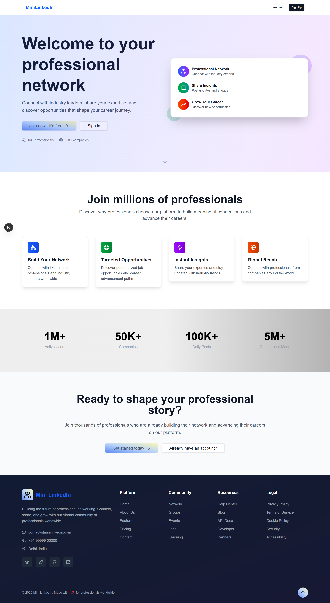
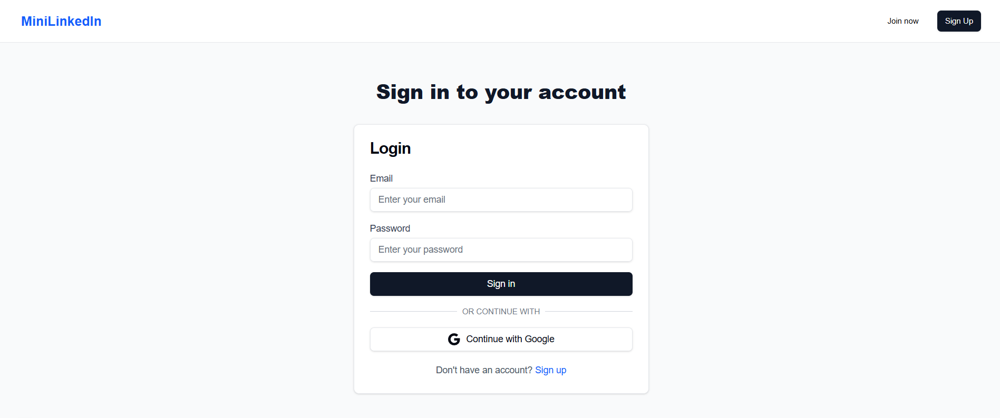
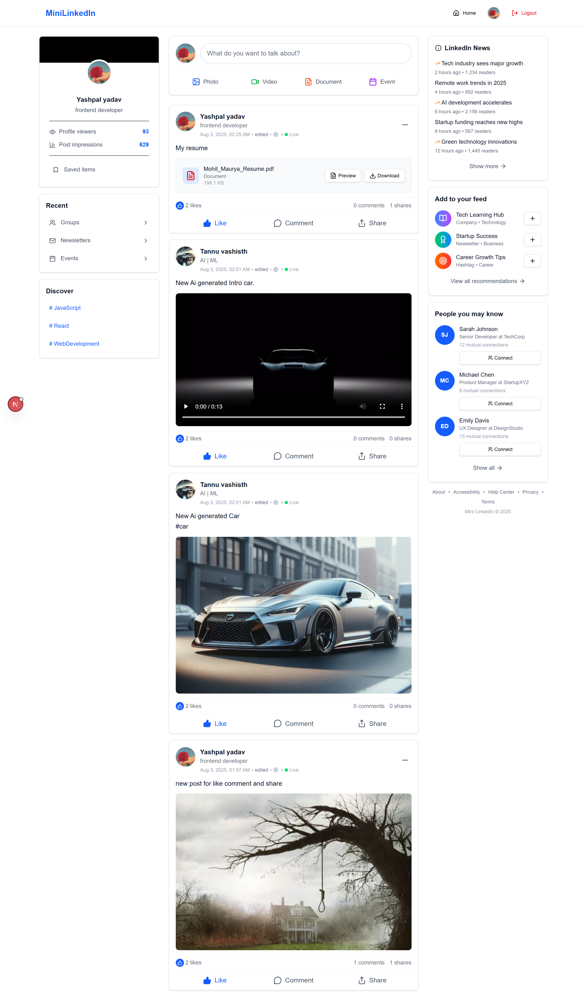
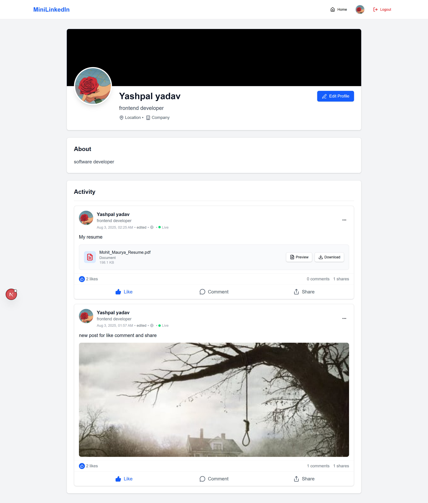
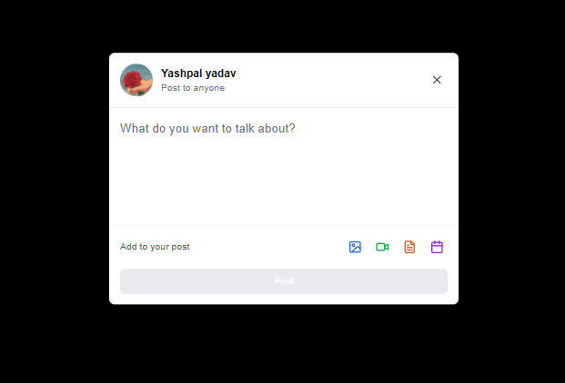

# Mini LinkedIn-like Community Platform

A modern, full-stack social networking platform built with Next.js, React, Firebase, MongoDB, and Express.js. This application provides essential LinkedIn-like features including user authentication, profile management, and a social feed for sharing posts.

## 🌟 Live Demo

Experience the platform: [Demo Link] (Add your deployment URL here)

## 📸 Screenshots

### Homepage & Landing

*Beautiful landing page with call-to-action*

### User Authentication

*Secure login with Firebase Auth*

### Main Feed

*Dynamic social feed with real-time updates*

### Profile Management

*Comprehensive profile management and editing*

### Post Creation & Interaction

*Rich post creation with media support and detailed post views*


## 🚀 Features

### ✅ User Authentication
- Firebase Authentication for secure login/registration
- Email and password authentication
- Protected routes and user sessions
- Automatic user profile creation

### ✅ User Profiles
- Personalized user profiles with name, email, and bio
- Profile editing capabilities
- User avatars with initials fallback
- Individual user post history

### ✅ Social Feed
- Create and publish text posts
- Real-time feed updates
- Post timestamps and author information
- Clean, LinkedIn-inspired UI

### ✅ Responsive Design
- Modern UI built with Tailwind CSS
- Shadcn UI components for consistent design
- Mobile-responsive layout
- Dark mode support

## 🛠 Tech Stack

### Frontend
- **Next.js 15** - React framework with App Router
- **React 19** - UI library
- **Tailwind CSS** - Utility-first CSS framework
- **Shadcn UI** - High-quality UI components
- **Lucide React** - Beautiful icons
- **Lenis** - Smooth Scrolling

### Backend
- **Express.js** - Node.js web framework
- **MongoDB** - Document database
- **Mongoose** - MongoDB object modeling

### Authentication
- **Firebase Auth** - User authentication and management

## 📦 Installation & Setup

### Prerequisites
- Node.js (v18 or higher)
- MongoDB (local installation or MongoDB Atlas)
- Firebase project setup

### 1. Clone the Repository
```bash
git clone <repository-url>
cd mini-linkedin-platform
```

### 2. Install Dependencies
```bash
# Install frontend dependencies
npm install

# Install backend dependencies
npm run server:install
```

### 3. Environment Configuration

#### Frontend Environment
Create a `.env.local` file in the root directory:
```env
NEXT_PUBLIC_API_URL=http://localhost:5000/api
NEXT_PUBLIC_FIREBASE_API_KEY=your-firebase-api-key
NEXT_PUBLIC_FIREBASE_AUTH_DOMAIN=your-project.firebaseapp.com
NEXT_PUBLIC_FIREBASE_PROJECT_ID=your-project-id
NEXT_PUBLIC_FIREBASE_STORAGE_BUCKET=your-project.appspot.com
NEXT_PUBLIC_FIREBASE_MESSAGING_SENDER_ID=your-sender-id
NEXT_PUBLIC_FIREBASE_APP_ID=your-app-id
```

#### Backend Environment
Create a `.env` file in the `server` directory:
```env
MONGODB_URI=mongodb://localhost:27017/mini-linkedin
PORT=5000
```

### 4. Firebase Setup
1. Create a new Firebase project at [Firebase Console](https://console.firebase.google.com/)
2. Enable Authentication with Email/Password provider
3. Get your Firebase configuration from Project Settings
4. Update the environment variables with your Firebase config

### 5. MongoDB Setup
- **Local MongoDB**: Install MongoDB locally and ensure it's running on port 27017
- **MongoDB Atlas**: Create a cluster and update the MONGODB_URI in your environment file

### 6. Start the Application

#### Development Mode
```bash
# Terminal 1: Start the backend server
npm run server

# Terminal 2: Start the frontend development server
npm run dev
```

#### Production Mode
```bash
# Build the frontend
npm run build

# Start the production server
npm start
```

### 7. Access the Application
- Frontend: [http://localhost:3000](http://localhost:3000)
- Backend API: [http://localhost:5000](http://localhost:5000)

## 📁 Project Structure

```
mini-linkedin-platform/
├── src/
│   ├── app/                           # Next.js App Router
│   │   ├── api/                       # API route handlers
│   │   │   ├── posts/                 # Post-related API routes
│   │   │   ├── users/                 # User-related API routes
│   │   │   └── profile/               # Profile API routes
│   │   ├── auth/                      # Authentication pages
│   │   │   ├── login/                 # Login page
│   │   │   └── register/              # Registration page
│   │   ├── profile/                   # Profile pages
│   │   │   ├── [id]/                  # Dynamic profile pages
│   │   │   └── complete/              # Profile completion
│   │   ├── post/                      # Individual post pages
│   │   │   └── [postId]/              # Dynamic post detail
│   │   ├── globals.css                # Global styles
│   │   ├── layout.js                  # Root layout component
│   │   └── page.js                    # Homepage
│   ├── components/                    # React components
│   │   ├── ui/                        # Base UI components
│   │   ├── AuthContext.js             # Authentication context
│   │   ├── Header.jsx                 # Navigation header
│   │   ├── Footer.jsx                 # Site footer
│   │   ├── PostCard.jsx               # Post display component
│   │   ├── PostFeed.jsx               # Main feed component
│   │   ├── CreatePost.jsx             # Post creation form
│   │   ├── LeftSidebar.jsx            # Left sidebar component
│   │   ├── RightSidebar.jsx           # Right sidebar component
│   │   ├── LoadingScreen.jsx          # Loading animations
│   │   └── ProfileGuard.jsx           # Route protection
│   ├── context/                       # React contexts
│   │   └── AuthContext.js             # Authentication state
│   ├── lib/                          # Utility functions
│   │   ├── firebase.js               # Firebase configuration
│   │   ├── utils.js                  # Helper functions
│   │   └── realtime.js               # Real-time polling
│   └── styles/                       # Additional styles
├── server/                           # Express.js backend
│   ├── models/                       # MongoDB models
│   │   ├── User.js                   # User model
│   │   ├── Post.js                   # Post model
│   │   └── Comment.js                # Comment model
│   ├── routes/                       # API routes
│   │   ├── users.js                  # User endpoints
│   │   ├── posts.js                  # Post endpoints
│   │   └── comments.js               # Comment endpoints
│   ├── middleware/                   # Express middleware
│   ├── uploads/                      # File upload directory
│   ├── .env                         # Environment variables
│   ├── index.js                     # Server entry point
│   └── package.json                 # Backend dependencies
├── public/                          # Static assets
│   ├── screenshots/                 # Application screenshots
│   └── favicon.ico                  # Site favicon
├── .env.local                       # Frontend environment
├── tailwind.config.js               # Tailwind configuration
├── next.config.js                   # Next.js configuration
├── package.json                     # Frontend dependencies
└── README.md                        # Project documentation
```

## 🔗 API Endpoints

### Users
- `GET /api/users/:firebaseUid` - Get user profile
- `POST /api/users` - Create/update user profile
- `PUT /api/users/:firebaseUid` - Update user profile
- `POST /api/users/complete-profile` - Complete user profile

### Posts
- `GET /api/posts` - Get all posts
- `GET /api/posts/:postId` - Get specific post
- `GET /api/posts?userId=:userId` - Get posts by user
- `POST /api/posts` - Create a new post
- `PUT /api/posts/:postId` - Update post
- `DELETE /api/posts/:postId` - Delete post
- `POST /api/posts/:postId/like` - Like/unlike post
- `POST /api/posts/:postId/share` - Share post

### Comments
- `GET /api/posts/:postId/comments` - Get post comments
- `POST /api/posts/:postId/comments` - Add comment
- `DELETE /api/comments/:commentId` - Delete comment

### File Upload
- `POST   /api/upload` - Upload media files

## 🎨 UI Components

### Custom Components
- **Header** - Navigation with authentication state
- **PostFeed** - Dynamic feed with infinite scroll potential
- **PostCard** - Individual post display
- **CreatePost** - Post creation form
- **Card, Button, Input, Textarea** - Reusable UI primitives

## 🔐 Authentication Flow

1. **Registration**: Users create accounts with email/password
2. **Profile Creation**: Automatic profile creation in MongoDB
3. **Login**: Firebase handles authentication
4. **Protected Routes**: AuthContext provides user state
5. **Logout**: Clean session termination

## 🚀 Deployment

### Frontend (Vercel)
1. Connect your GitHub repository to Vercel
2. Set environment variables in Vercel dashboard
3. Deploy automatically on push to main branch

### Backend (Heroku/Railway/DigitalOcean)
1. Create a new app on your preferred platform
2. Set environment variables
3. Deploy the `server` directory

### Database (MongoDB Atlas)
1. Create a MongoDB Atlas cluster
2. Update the MONGODB_URI environment variable
3. Ensure network access is configured

## 🛡 Security Features

- Firebase Authentication for secure user management
- Environment variables for sensitive configuration
- CORS protection for API endpoints
- Input validation and sanitization
- Protected API routes

## 🔄 Future Enhancements

### Planned Features
- **Commenting System** - Add comments to posts
- **Like/Reaction System** - Engage with posts
- **User Connections** - Follow/connect with other users
- **Image Upload** - Support for image posts and profile pictures
- **Real-time Notifications** - Live updates for interactions
- **Advanced Search** - Search users and posts
- **Professional Features** - Job postings, company pages
- **Messaging System** - Direct messages between users

### Technical Improvements
- **Caching** - Redis for improved performance
- **File Storage** - Cloudinary/S3 for media files
- **Push Notifications** - PWA capabilities
- **Testing** - Unit and integration tests
- **Analytics** - User engagement tracking

## 🤝 Contributing

1. Fork the repository
2. Create a feature branch (`git checkout -b feature/new-feature`)
3. Commit your changes (`git commit -am 'Add new feature'`)
4. Push to the branch (`git push origin feature/new-feature`)
5. Create a Pull Request

## 📄 License

This project is licensed under the MIT License - see the [LICENSE](LICENSE) file for details.

## 🙏 Acknowledgments

- Next.js team for the amazing framework
- Tailwind CSS for the utility-first CSS framework
- Shadcn for the beautiful UI components
- Firebase for authentication services
- MongoDB for the database solution

---

**Happy coding! 🚀**
